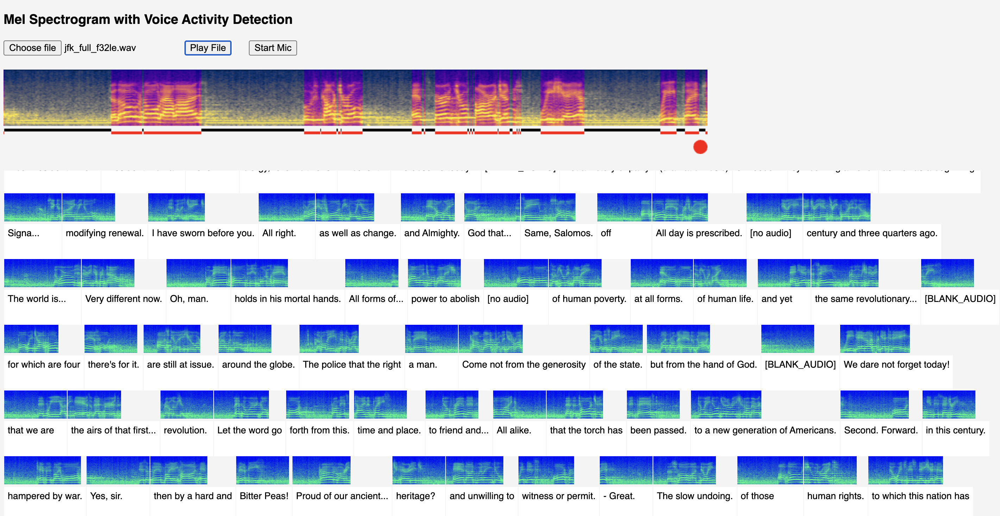

$${\huge \color{pink}🤫hush}$$
### Silent Whisper inference for privacy and performance.

Current speech-to-text wrappers tend to require audio input, even though all 
models use mel spectrograms, not audio, internally.

This has drawbacks, as audio needs to be sent from the user's device to the 
server and if that is not possible the implementation is restricted to run 
locally.

_**hush**_ uses quantized 8-bit grayscale images, not audio.

As well as helping to prevent leakage of identifiable information, this approach
simplifies voice activity detection, caching, storage / retrieval and bandwidth 
considerations by removing audio signal processing and audio payloads from the 
pipeline.

For more background on how mel spectrograms are generated and used, see 
[wavey-ai/mel-spec](https://github.com/wavey-ai/mel-spec.git) 

To run inference, _**hush**_ uses a fork of the brilliant [whisper-burn](https://github.com/wavey-ai/whisper-burn.git) 
that uses Rust's [burn-rs](https://github.com/burn-rs/burn) Deep Learning framework
and [tch-rs](https://github.com/LaurentMazare/tch-rs) (Rust bindings for the C++ api of PyTorch). 
The fork provides a mel API and exposes whisper-burn as a service, and configures a CUDA backend.

#### demo

Chrome is required as the demo currently uses SIMD instructions.

[https://hush.wavey.ai](https://hush.wavey.ai)



The demo UI has the following components:

* non-blocking WASM workers and Audio Worklets that convert audio (from file or 
  microphone) into mel spectrograms on a stream with ultra-low latency
* ultra-low latency voice activity detection that works by applying Sobel edge 
  detection to spectrograms. This is used to determine were to segment streaming
  audio for transcription (ideally always cutting between words, and not in the 
  middle of a word.)
* real-time visualisations on canvas
* a client that sends audio segments as images to the AWS service running 
  Whisper on GPU, receiving a text translation back

Note that it is significantly faster with Dev Tools console closed.

#### running

The server will start accepting connections immediately and will load models in
the background. To ensure quick cold starts the `tiny_en` model is always loaded
and routed to first, with requests always being routed to the largest model 
available. TODO: Make all this configurable, and allow model to be specified in
the request.

```
 INFO  hush > hush server listening on 0.0.0.0:1337
 INFO  hush > loading model "tiny_en"
 INFO  hush > loading model "medium_en"
 INFO  cached_path::cache > Cached version of https://huggingface.co/gpt2/resolve/main/tokenizer.json is up-to-date
 INFO  cached_path::cache > Cached version of https://huggingface.co/gpt2/resolve/main/tokenizer.json is up-to-date
 INFO  hush               > "tiny_en" loaded in 9 secs
 INFO  hush               > "medium_en" loaded in 109 secs
 ```

Any GET request will return a simple status:

```
{"done":3,"models":1,"queue":0}

done: number of completed requests
queue: number of pending requests
models:
    0 = non loaded
    1 = tiny_en loaded
    2 = medium_en loaded
```

#### deployment

The included `ami.sh` creates an image with GPU support for running NVIDIA T4 
Tensor Core instances. _A public ami will be provided soon._

The cloudformation template creates an Auto Scaling Group that requests a 
`g4dn.xlarge` spot instance and exposes the demo api on [https://hush.wavey.ai](https://hush.wavey.ai).

The same template creates the demo UI, Github auth and a self-updating AWS 
CodePipeline project that applies infrastructure changes via the template
alongside any code changes in the repo.

The initial deployment should be done from local via the `make app` task, this
will create the CodePipeline pipeline.

Full instructions: TODO.

#### TODO

This is very much a POC and a WIP.

* ~fix wasm content type with a cloud function~
* Traffic light status on UI for GPU spot instance: up/down/provisioning
* ~Add real-time metrics to API~ and visibility in UI 
* Support for Safari, non-SIMD version.
* Support Web GPU (AWS G4ad instance w/AMD Radeon Pro V520 GPU)
* Admin UI 
* Add auth to EC2 service
* WebRTC Data Channel API
* ~Load medium_en model by default~
* Allow any audio format to be uploaded, resampling as required
* Clients for mobile
